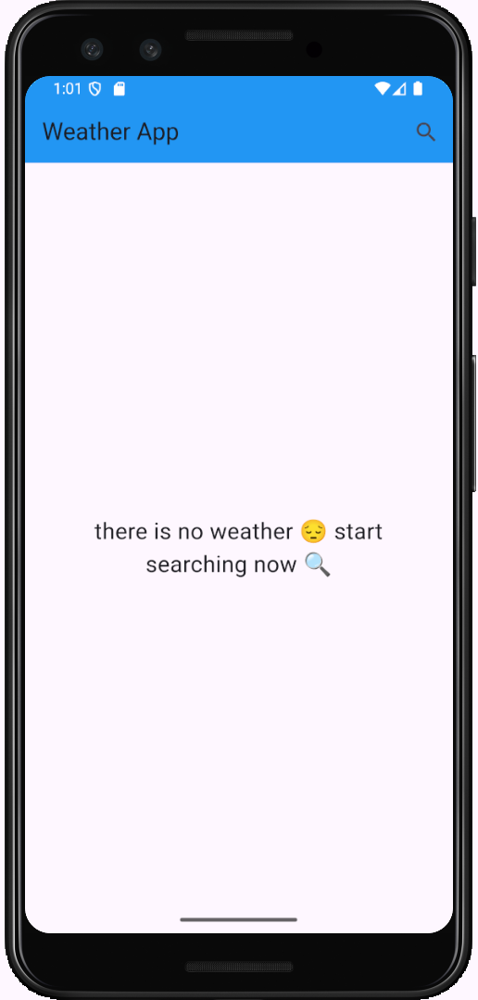
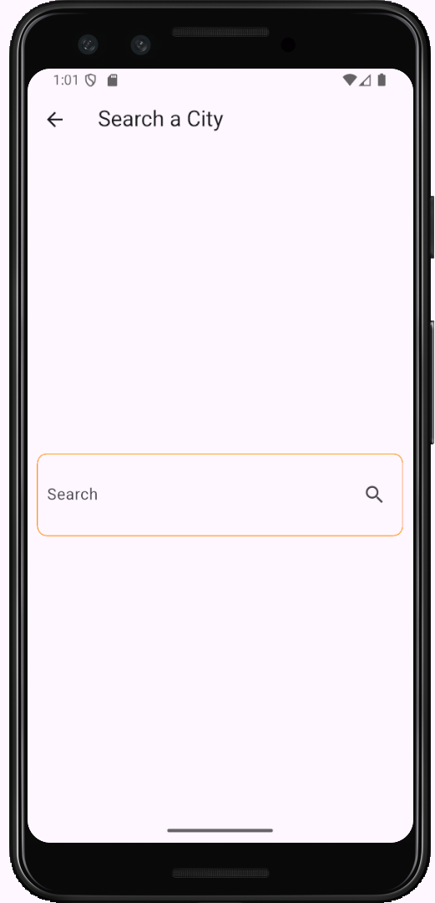
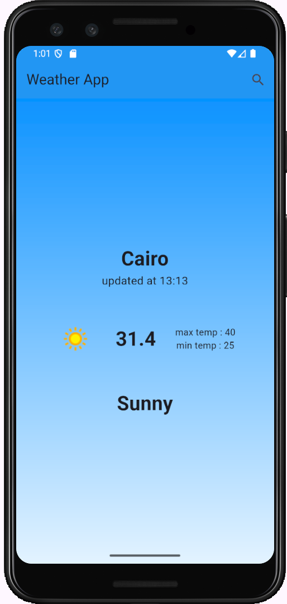

# 🌤 Weather App – Flutter

A clean and simple weather app built using **Flutter**, showcasing real-time weather data with a smooth search experience.  
This project is part of my Flutter learning journey through **Tharwat Samy's course (70%)**.

---

## 🚀 Features

- Search any city by name 🔎
- Get real-time weather data including:
  - ✅ City name
  - ✅ Current temperature
  - ✅ Max & Min temperatures
  - ✅ Weather condition
  - ✅ Last updated time

---

## 📱 Screenshots

| Empty State                     | Search                            | Weather Result                    |
| ------------------------------- | --------------------------------- | --------------------------------- |
|  |  |  |

---

## 🛠 Tech Stack

- **Flutter**
- **Dio** – for HTTP requests
- **Cubit (Bloc)** – for state management
- **Free Weather API**

---

## 📦 How to Run

```bash
flutter pub get
flutter run

---

## 🧠 What I Learned

- Cubit vs Bloc basics
- Handling async API requests
- UI feedback on state changes
- Clean navigation and minimal design

---

## 📬 Contact

Feel free to connect with me on [LinkedIn](https://www.linkedin.com/in/s-barakat-s)
Or check out more on [GitHub](https://github.com/s-barakat-s)
```
